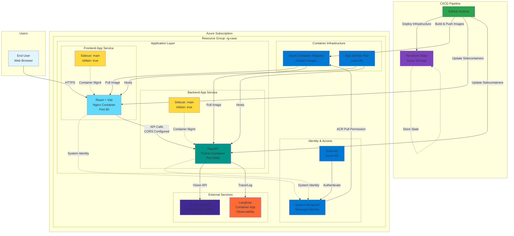

# Lego Case - Image Question Answering Platform

A production-ready full-stack application that allows users to upload images and ask questions about them using Azure OpenAI multimodal capabilities (GPT-4 Vision / Phi-4), with observability powered by Langfuse.

## 🏗️ Architecture

### System Architecture Diagram



### Architecture Components

| Component | Technology | Purpose | Configuration |
|-----------|-----------|---------|---------------|
| **Frontend** | React 18 + TypeScript + Vite | User interface for image upload & Q&A | Nginx, Port 80, Sidecar mode |
| **Backend** | FastAPI + Python 3.13 + uvicorn | REST API for multimodal processing | uvicorn, Port 8000, Sidecar mode |
| **Container Registry** | Azure Container Registry (ACR) | Docker image storage & distribution | Managed Identity auth |
| **App Service Plan** | Azure App Service (Linux) | Container hosting platform | B1 tier, Linux, Sidecar support |
| **Identity** | Entra ID + Managed Identity | Authentication & authorization | System-assigned, ACR pull role |
| **AI Service** | Azure OpenAI | GPT-4 Vision / Phi-4 multimodal AI | API key authentication |
| **Observability** | Langfuse | Request tracing & token tracking | Container App, PostgreSQL backend |
| **CI/CD** | GitHub Actions | Automated deployment pipeline | Parallel backend/frontend deploy |
| **IaC** | Terraform 1.9 | Infrastructure as Code | Remote state in Azure Storage |

### Key Architecture Decisions

#### 1. **Sidecar Pattern**
- Both apps use Azure App Service sidecontainer mode
- Main container marked with `isMain: true`
- Eliminates Azure Portal conversion popups
- Enables future extensibility (Redis, monitoring agents, etc.)

#### 2. **Managed Identity (No Credentials)**
- System-assigned managed identity for each app
- ACR pull permissions via RBAC
- No stored credentials or passwords
- Automatic token rotation

#### 3. **Parallel Deployment**
```
Infrastructure
    ├─→ Backend (build + deploy + health check)
    └─→ Frontend (build + deploy + health check)
        → Summary
```
- ~50% faster than sequential deployment
- Independent failure isolation
- Efficient resource utilization

#### 4. **Dynamic Configuration**
- CORS origins auto-configured via CI/CD
- API URLs injected at deployment time
- Environment variables managed by GitHub Secrets
- No hardcoded URLs

## 🚀 Features

- **Image Question Answering**: Upload images and ask questions about them
- **Modern React UI**: Clean, responsive interface built with React + TypeScript
- **Multimodal AI**: Powered by Azure OpenAI vision models (GPT-4 Vision / Phi-4)
- **Full Observability**: Request tracing and token usage tracking with Langfuse
- **Production Ready**: Deployed on Azure App Service with auto-scaling
- **Automated CI/CD**: GitHub Actions handles infrastructure + deployment in parallel
- **Infrastructure as Code**: Terraform manages all Azure resources
- **Managed Identity**: Zero-credential authentication with Entra ID
- **Sidecar Architecture**: Extensible container pattern for future enhancements

## 📋 Prerequisites

- Python 3.13+
- [uv](https://github.com/astral-sh/uv) (Fast Python package manager)
- Docker (for local development)
- Azure CLI (for deployment)
- Terraform 1.9+ (for infrastructure)
- Azure subscription with permissions to create resources

## 🔧 Local Development

### 1. Clone the repository

```bash
git clone <your-repo-url>
cd lego-case
```

### 2. Create `.env` file

```bash
cp .env.example .env
# Edit .env with your credentials
```

Required environment variables:
```env
OPENAI_API_KEY=your_azure_openai_key
LANGFUSE_SECRET_KEY=your_langfuse_secret
LANGFUSE_PUBLIC_KEY=your_langfuse_public
LANGFUSE_BASE_URL=https://your-langfuse-url
```

### 3. Run locally with Python

```bash
# Install dependencies
uv pip install -r pyproject.toml

# Run the app
cd backend
uvicorn app:app --reload
```

### 4. Run with Docker

```bash
cd backend
docker build -t question-answer-api .
docker run -p 8000:8000 --env-file ../.env question-answer-api
```

### 5. Test the API

```bash
# Health check
curl http://localhost:8000/health

# Ask a question (text only)
curl -X POST http://localhost:8000/chat/ask \
  -H "Content-Type: application/json" \
  -d '{"question": "What is AI?"}'
```

## ☁️ Deployment

### Infrastructure Setup (One-time)

#### 1. Setup Remote Backend (Recommended)

```bash
cd terraform

# Create Azure Storage for Terraform state
./setup-backend.sh

# This creates storage and outputs configuration
# Save the values for later use
```

**Why?** Terraform state files can be 100MB+ and should never be in Git. See [Backend Guide](terraform/BACKEND.md).

#### 2. Configure and Apply Infrastructure

```bash
# Create terraform.tfvars from .env
./setup-vars.sh

# Initialize Terraform with remote backend
terraform init -backend-config=backend-config.tfbackend

# Preview changes
terraform plan

# Apply infrastructure
terraform apply
```

This creates:
- Azure Container Registry with admin access
- App Service Plan (Linux B1)
- Backend Web App with system-assigned managed identity
- Frontend Web App with system-assigned managed identity
- Role assignments for ACR pull access
- Sidecontainer configuration for both apps

### Application Deployment

#### Option 1: Full Stack Deployment (Recommended)

Deploy both frontend and backend at once:

```bash
./deploy-all.sh
```

This script:
1. Builds and pushes both Docker images to ACR
2. Updates sidecontainers with new images
3. Configures CORS (backend) and API URL (frontend)
4. Restarts both apps
5. Performs health checks
6. Auto-increments version numbers

#### Option 2: Individual Deployment

Deploy services separately:

```bash
# Backend only
cd backend && ./deploy.sh

# Frontend only
cd frontend && ./deploy.sh
```

**Note**: You'll need to manually configure CORS and API URLs if deploying individually.

#### Option 3: Automated CI/CD (Recommended for Production)

Push to `main` branch triggers automatic parallel deployment:

```bash
git add .
git commit -m "feat: add new feature"
git push origin main
```

The CI/CD pipeline will:
1. ✅ Deploy infrastructure changes (if any)
2. ✅ **Parallel**: Build and deploy backend (if changed)
3. ✅ **Parallel**: Build and deploy frontend (if changed)
4. ✅ Configure cross-app environment variables:
   - Backend: `CORS_ORIGINS=https://frontend-url`
   - Frontend: `VITE_API_URL=https://backend-url`
5. ✅ Run health checks on both apps
6. ✅ Commit version updates back to repo

## 🔄 CI/CD Pipeline

The deployment pipeline automatically handles the complete stack in parallel:

### Pipeline Stages

```
Infrastructure
    ├─→ Backend (build + deploy + health check)
    └─→ Frontend (build + deploy + health check)
        → Summary
```

**Deployment Time:**
- Sequential (old): ~15-20 minutes
- Parallel (current): ~8-12 minutes ⚡

### What Gets Deployed When

- **`terraform/**` changes**: Updates infrastructure (registry, app services, etc.)
- **`backend/**` changes**: Builds new backend image, updates sidecontainer, restarts
- **`frontend/**` changes**: Builds new frontend image, updates sidecontainer, restarts
- **Any change**: Re-configures CORS and API URLs to link apps

### GitHub Actions Workflow

See `.github/workflows/deploy-main.yml` for the complete workflow.

**Required GitHub Secrets:**
- `AZURE_CREDENTIALS`: Service principal for Azure login
- `TF_BACKEND_RESOURCE_GROUP`: Terraform backend resource group
- `TF_BACKEND_STORAGE_ACCOUNT`: Terraform backend storage account
- `TF_BACKEND_CONTAINER`: Terraform backend container name
- `TF_BACKEND_STORAGE_KEY`: Terraform backend access key
- `OPENAI_API_KEY`: Azure OpenAI API key
- `LANGFUSE_SECRET_KEY`: Langfuse secret key
- `LANGFUSE_PUBLIC_KEY`: Langfuse public key
- `LANGFUSE_BASE_URL`: Langfuse instance URL

## 📁 Project Structure

```
lego-case/
├── frontend/                   # React application
│   ├── src/
│   │   ├── components/        # React components
│   │   ├── hooks/             # Custom hooks
│   │   ├── types/             # TypeScript types
│   │   ├── App.tsx            # Main app component
│   │   └── config.ts          # API configuration
│   ├── Dockerfile             # Frontend container (Nginx)
│   ├── deploy.sh              # Sidecontainer deployment
│   ├── package.json           # Node dependencies
│   └── version.txt            # Current version
├── backend/                    # FastAPI application
│   ├── routers/
│   │   ├── chat.py            # Text Q&A endpoint
│   │   └── multimodal.py      # Image Q&A endpoint
│   ├── app.py                 # Main application
│   ├── config.py              # Settings & env vars
│   ├── Dockerfile             # Backend container (Python)
│   ├── deploy.sh              # Sidecontainer deployment
│   ├── pyproject.toml         # Python dependencies
│   └── version.txt            # Current version
├── terraform/                  # Infrastructure as Code
│   ├── main.tf                # Azure resources (ACR, App Services, Managed Identity)
│   ├── variables.tf           # Input variables
│   ├── outputs.tf             # Output values
│   ├── providers.tf           # Azure provider config
│   ├── setup-backend.sh       # Backend storage setup
│   └── setup-vars.sh          # Env to tfvars helper
├── .github/
│   └── workflows/
│       ├── deploy-main.yml    # Parallel deployment pipeline
│       └── terraform-plan.yml # Terraform preview on PRs
├── deploy-all.sh              # Deploy full stack locally
├── .gitignore                 # Git ignore rules
└── README.md                  # This file
```

## 🔒 Security

### Authentication & Authorization
- ✅ **Entra ID (Azure AD)** integration via Managed Identity
- ✅ **System-assigned identities** for each app (no credentials stored)
- ✅ **RBAC-based access** to Azure Container Registry
- ✅ **Automatic token rotation** by Azure platform

### Secrets Management
- ✅ Environment variables stored in **GitHub Secrets**
- ✅ `.env` files excluded from Git (never committed)
- ✅ Secrets injected at runtime (not baked into images)
- ✅ API keys rotated regularly

### Infrastructure Security
- ✅ `.terraform` directory excluded from version control
- ✅ Terraform state stored in **Azure Storage Backend**
- ✅ Manual approval required for production deployments
- ✅ CORS properly configured (whitelist-based)

### Network Security
- ✅ HTTPS enforced on all endpoints
- ✅ CORS configured dynamically via CI/CD
- ✅ App Service managed SSL certificates

## 📊 Monitoring & Observability

### Application Logs
```bash
# View backend logs in Azure
az webapp log tail \
  --name question-answer-api \
  --resource-group rg-case

# View frontend logs
az webapp log tail \
  --name question-answer-frontend \
  --resource-group rg-case
```

### Langfuse Dashboard
Visit your Langfuse URL to monitor:
- 📊 Request traces with full context
- 💰 Token usage and costs
- ⏱️ Response times and latency
- ❌ Error rates and types
- 🔍 User sessions and patterns

### Azure Portal Metrics
- Container metrics (CPU, memory)
- HTTP request metrics
- Sidecontainer health status
- Managed identity authentication logs

## 🧪 Testing

```bash
# Health check
curl https://question-answer-api.azurewebsites.net/health

# Test backend API
curl -X POST https://question-answer-api.azurewebsites.net/chat/ask \
  -H "Content-Type: application/json" \
  -d '{"question": "What is AI?"}'

# Test frontend
curl https://question-answer-frontend.azurewebsites.net
```

## 🐛 Troubleshooting

### Sidecontainer Issues

**Azure Portal shows "Update to sidecar pattern" banner:**
- This is expected - apps are already in sidecontainer mode
- Don't click the button (scripts handle everything)
- Banner is just a suggestion, safe to ignore

**Check sidecontainer configuration:**
```bash
az webapp sitecontainers list \
  --name question-answer-api \
  --resource-group rg-case -o table
```

### Local Development Issues

**Port already in use:**
```bash
lsof -ti:8000 | xargs kill -9
```

**Dependencies not installing:**
```bash
uv pip install --upgrade pip
uv pip install -r backend/pyproject.toml
```

### Deployment Issues

**Managed Identity permission errors:**
```bash
# Verify role assignment
az role assignment list \
  --assignee <managed-identity-principal-id> \
  --scope <acr-resource-id>

# Recreate role assignment if needed (Terraform will handle this)
terraform apply
```

**Azure login fails:**
```bash
az login
az account set --subscription <your-subscription-id>
```

**App not updating after deployment:**
```bash
# Force restart
az webapp restart --name question-answer-api --resource-group rg-case
az webapp restart --name question-answer-frontend --resource-group rg-case
```

## 📚 Additional Resources

- [FastAPI Documentation](https://fastapi.tiangolo.com/)
- [Azure App Service Sidecar Docs](https://learn.microsoft.com/en-us/azure/app-service/configure-sidecar)
- [Azure Managed Identity](https://learn.microsoft.com/en-us/entra/identity/managed-identities-azure-resources/)
- [Langfuse Documentation](https://langfuse.com/docs)
- [Terraform Azure Provider](https://registry.terraform.io/providers/hashicorp/azurerm/latest/docs)

## 🤝 Contributing

1. Create a feature branch: `git checkout -b feature/your-feature`
2. Make changes and test locally
3. Commit with clear messages: `git commit -m "feat: add new feature"`
4. Push and create PR: `git push origin feature/your-feature`
5. Wait for CI checks to pass (Terraform plan preview)
6. Request review and merge
7. Automatic deployment to production on merge

## 📝 License

[Add your license here]

## 👤 Author

[Add your information here]

---

**Note**: This is a case study project demonstrating modern cloud-native microservices architecture with:
- Sidecar container pattern
- Managed Identity authentication
- Parallel CI/CD deployment
- Infrastructure as Code with Terraform
- Full observability with Langfuse
