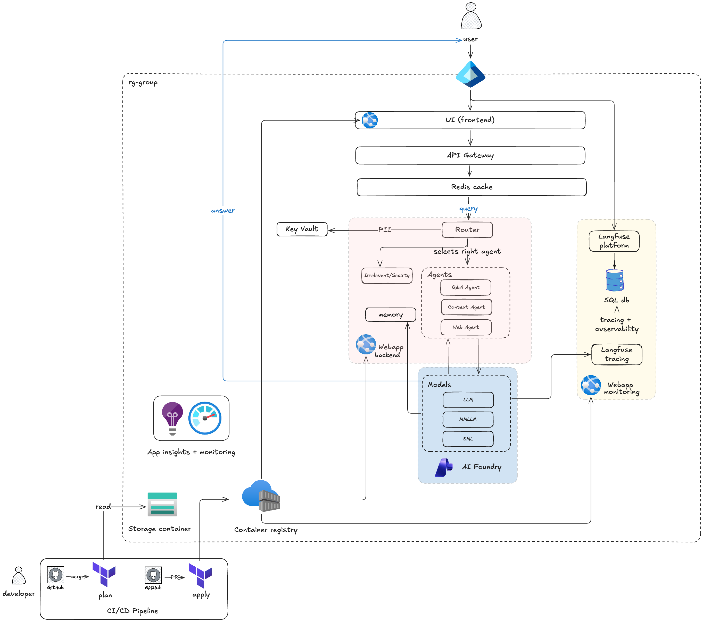
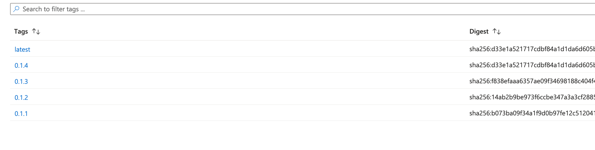
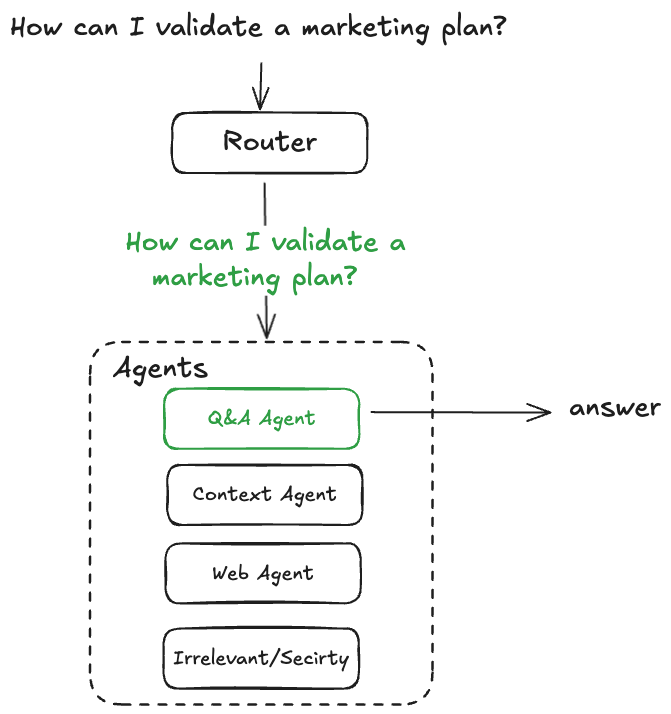
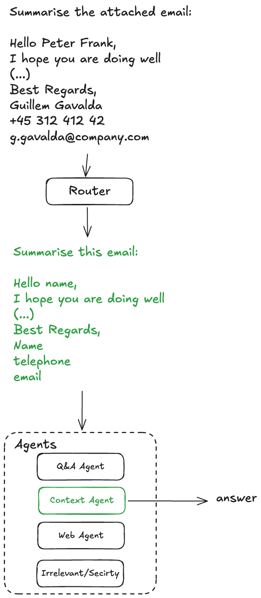
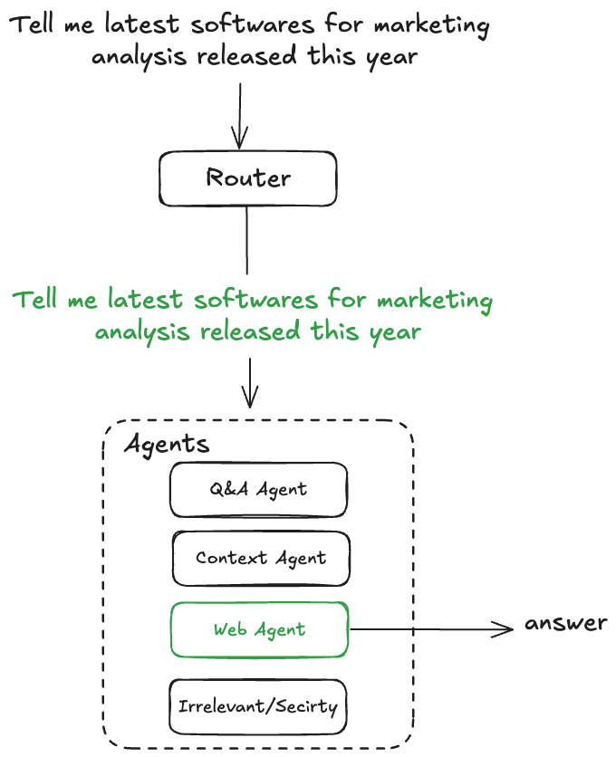
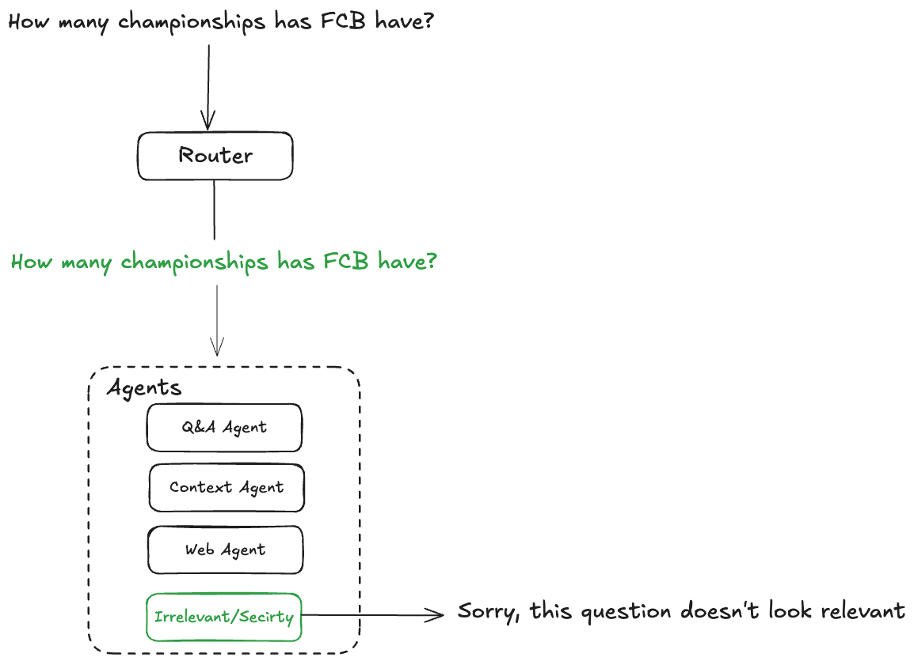
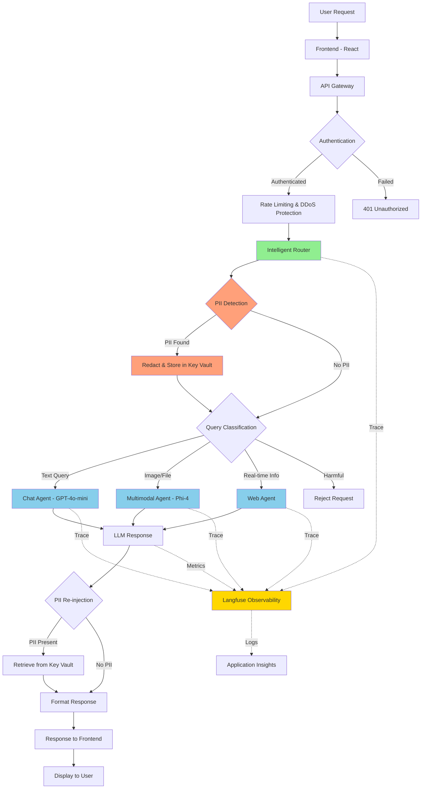

[Back to Home](index.md)

# Architecture

## Multi-Agent System Overview

The Peace Corps LLM Chatbot is built on a microservices architecture with an intelligent router orchestrating specialized agents. This design provides flexibility, security, and control over user queries.

### Why Microservices Architecture?

In the book **"Fundamentals of Software Architecture"** by Mark Richards and Neal Ford (O'Reilly Media, Inc.), various architecture designs are described. After careful analysis, we selected the microservices architecture.

#### Architecture Selection Summary

**Microservices - Best Fit**

**Why:**
- Natural service boundaries (Chat, File Processing, LLM Gateway, Sessions, Auth)
- Container-native with independent scaling
- Langfuse monitoring integration
- Technology flexibility per service

**Why Others Don't Fit**

| Architecture | Reason |
|--------------|--------|
| Layered | Monolithic, can't scale independently |
| Pipeline | One-way flow, not interactive |
| Event-Driven | Overkill for synchronous chat |

  
  
<em>High-level system architecture showing the intelligent router and specialized agents</em>

---

## Azure Infrastructure Components

### Security & Identity
- **Entra ID**: MFA authentication and RBAC (Role-Based Access Control)
- **API Gateway**: Redis caching, Firewall, DDoS policies, and rate limiting

### Monitoring & Observability
- **Application Insights**: Application monitoring and performance tracking
- **Langfuse**: LLM-specific observability, tracing, and cost tracking

### Storage & Data
- **Storage Account**: Terraform remote state storage
- **PostgreSQL Database**: Session management, traceability, and observability data
- **Redis Cache**: Conversation history and response caching

### AI & ML
- **AI Foundry**: Deploy and test LLM models with prompt engineering tools
- **Container Registry**: Version control for Docker images (frontend and backend)

### Compute
- **Container Apps**: 
  - Backend (FastAPI with Pydantic settings and Uvicorn)
  - Frontend (React with npm)
  - Langfuse (observability platform)
- **Platform**: Linux / AMD64

  
  
<em>AI Foundry: Model deployment and container registry</em>

---

## Core Agent Components

1. Intelligent Router (SML)

The router uses a Small Language Model to:
- Classify incoming queries by intent and complexity
- Detect and redact PII (Personal Identifiable Information)
- Route requests to the appropriate specialized agent
- Filter malicious or harmful queries

2. Chat Agent (Text-Only Queries): Handles standard text-based conversational queries using Azure models.

3. Multimodal Agent (Vision + Text): Processes queries involving images, documents, or other visual content using Azure's multimodal models.

4. Web Agent (Real-Time Information): Retrieves real-time information from the web to answer queries requiring current data.

Examples:

  
  
<em>Intelligent Router: Query classification </em>

  
  
<em>Context agent with and PII detection flow </em>

  
  
<em> Web agent  for real time information </em>

  
  
<em>Security: Irrelevant and attacks</em>

### 5. Security & Observability Layer

**PII Protection:**
- Router-level PII detection before reaching LLM APIs
- Secure storage in Azure Key Vault
- Re-injection for user-facing responses

**Observability (Langfuse):**
- Comprehensive trace logging
- Cost tracking per user/model/query
- Performance monitoring across the request chain
- Token usage analytics

**Rate Limiting & DDoS Protection:**
- Azure API Gateway as entry point
- Per-user and per-IP rate limits
- Global throttling to prevent abuse

---

## Technology Stack

### Frontend
- **Framework**: React + TypeScript
- **Build Tool**: Vite
- **UI**: Modern chat interface with file upload support
- **Deployment**: Azure Container Apps
- **Platform**: Linux / AMD64

### Backend
- **Framework**: FastAPI (Python)
- **Server**: Uvicorn (ASGI)
- **Configuration**: Pydantic Settings
- **API Gateway**: Azure API Management
- **Authentication**: Azure Entra ID (formerly Azure AD)
- **Platform**: Linux / AMD64

### AI/ML
- **LLM Provider**: Azure OpenAI Service
- **Models**: GPT-4o-mini, Phi-4-multimodal
- **AI Platform**: Azure AI Foundry
- **Observability**: Langfuse (self-hosted on Azure)

### Infrastructure
- **Cloud**: Microsoft Azure
- **IaC**: Terraform
- **Caching**: Redis
- **Database**: PostgreSQL
- **Storage**: Azure Key Vault (secrets), Azure Blob Storage (files)
- **Monitoring**: Azure Application Insights
- **Container Registry**: Azure Container Registry

---

## Data Flow

### Flow Steps:

1. **User Request** → Frontend (React)
2. **API Gateway** → Authentication check
3. **Rate Limiting** → DDoS protection and throttling
4. **Intelligent Router** → PII detection and query classification
5. **PII Redaction** → Store sensitive data in Key Vault (if detected)
6. **Specialized Agent** → Route to appropriate agent (Chat, Multimodal, or Web)
7. **LLM Processing** → Generate response using Azure OpenAI models
8. **PII Re-injection** → Retrieve and insert PII back (if applicable)
9. **Response** → Format and return to frontend
10. **Display** → Show response to user

**Observability**: Every step traced through Langfuse with correlation IDs and logged to Application Insights

---

## Deployment Architecture

### CI/CD Pipeline
- **Platform**: GitHub Actions
- **Build**: Docker multi-stage builds
- **Registry**: Azure Container Registry
- **Deployment**: Automated deployment to Azure Container Apps

### Container Strategy
- **Backend Image**: Python FastAPI application
- **Frontend Image**: React application with Nginx
- **Version Control**: Semantic versioning with automated tagging

### Scaling & Availability
- **Auto-scaling**: Based on CPU/memory metrics
- **Min Instances**: 1 (cost-optimized)
- **Max Instances**: 10 (can be increased)
- **Health Checks**: HTTP endpoint monitoring
- **Regions**: West Europe (expandable to multi-region)

### Infrastructure as Code
- **Tool**: Terraform
- **State Storage**: Azure Storage Account (remote backend)
- **Modules**: Reusable components for each Azure resource
- **Version Control**: Git with pull request workflow

---

[Back to Home](index.md)
